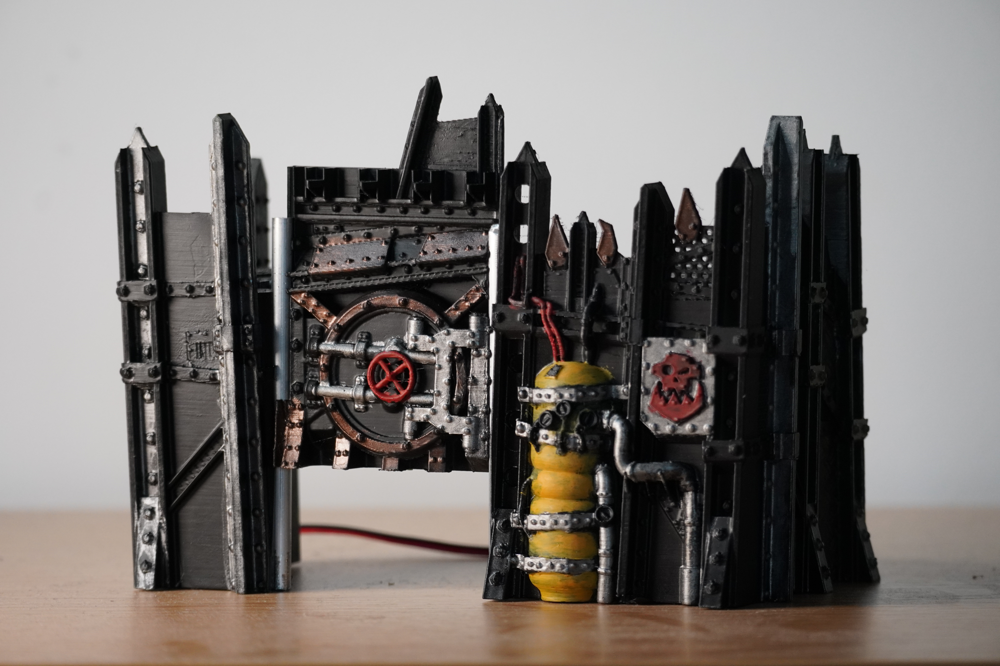
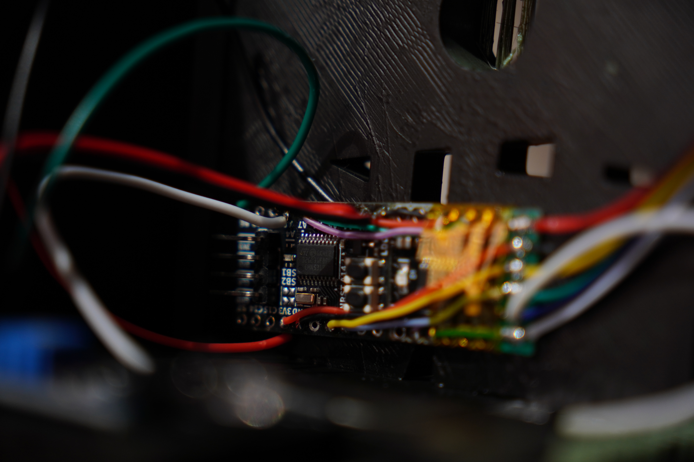
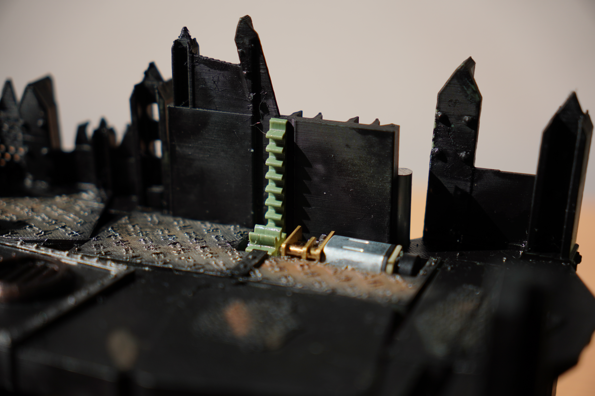

# Projekt Bramy 1 – STM32 Gate Controller

*Semestral university project developed in collaboration with a fellow student.*

---

## Ogólny obraz

W tym repozytorium znajduje się dokumentacja projektu studenckiego na zaliczenie przedmiotu *techniki mikroprocesorowe* 
Przedstawia model bramy mogącej być użytą podczas partii gier planszowych i nie planszowych
### projekt obejmuje
- idea systemu
- projekt części elektronicznej systemu
- oprogramowanie systemu
- modyfikacja modelu 3d zawierająca rozszerzenie obecnego modelu o elementy ruchome
- projekt wizualny w stylu *Warehamëra*


*Zdjęcie projektu od przodu*


---

## Cechy

- **STM32G0** (STM32G031) MCU z driverami HAL
- **Użyty enkoder** (TIM2) dokładne pozycjonowanie bramy podczas ruchu
- **Bang-Bang motor control** (TIM3) posiada możliwość sterowania prędkością poprzez użycie PWM
- **Timer‑based control loop** (TIM14) odświeżanie ~1 kHz
- **Czujnik IR** wykrywający konieczność otwarcia zapory
- **Elastyczność** możliwość ustawienia dowolnego zakresu otwarcia, prędkości i opóźnięń

---

## Hardware

| Komponent | Opis |
|-----------|-------------|
| MCU | **STM32G031** – Arm Cortex‑M0+, 64 KB flash, 16 KB RAM |
| Encoder | Enkoder zamontowany na wale silnika z hardwarowym pomiarem pozycji przez TIM2 |
| Motor driver | DRV8833 sterowany przez PWM na TIM3 dwa kanały użyte do sterowania - H‑bridge |
| silnik | GA12 N20 50RPM z wbudowanym enkoderem magnetycznym |
| moc | zasilanie 5v przez port USB-C |


*Elektronika modelu*


*Mechanika przesuwania bramy*

---

## Oprogramowanie

- Oprogramowanie zostało napisane w języku C
- Konfiguracja mikrokontrolera wygenerowana przez STM32_cube_MX
- Środowisko programistyczne - VScode + stm32 addon + cmake
- Debugger zarządzany przez cortex debugger
- debugowanie przez dedykowany programator ST_link v2.1

Oprogramowanie używa standardowych bibliotek HAL (Hardware Abstraction Layer):
1. Konfiguracja zegarów systemu (`SystemClock_Config`)
2. Inicjalizacja peryferiów (`MX_TIM2_Init`, `MX_TIM3_Init`, `MX_TIM14_Init`, `MX_GPIO_Init`)
3. Odczyt enkodera i zmiana czasów PWM `HAL_TIM_PeriodElapsedCallback`
4. Główna pętla asynchronicznie ustawia pozycje do której ma dążyć silnik


---

## Działanie

- Po podłączeniu zasilania, następuje zerowanie układu kinematycznego (homing).
- Następnie za każdym razem, kiedy czujnik IR wykryje przeszkodę, otwiera bramę na kilka sekund, następnie brama się zamyka.
- Homing wykopywany jest tylko raz po restarcie, w dalszym działaniu nie jest potrzebny ponieważ enkoder liczy pozycje silnika.

---

## Code logic 

Po inicjalizacji wszystkich peryferiów, startowane są timery 

``` C
  HAL_TIM_Encoder_Start(&htim2, TIM_CHANNEL_ALL); //<--- counter enkodera
  HAL_TIM_PWM_Start(&htim3, TIM_CHANNEL_1); //<--- kanał 1 sterowania PWM silnika
  HAL_TIM_PWM_Start(&htim3, TIM_CHANNEL_2); //<--- kanał 2 sterowania PWM silnika
  HAL_TIM_Base_Start_IT(&htim14); //<--- timer pętli kontroli
```
Następnie wywołujełujemy homing

``` C
HAL_TIM_Base_Start(&htim17); // homing startuje jeszcze jeden timer, używany jako timeout homeowania
```
W pętli while nie dzieje się nic
``` C
while(1){}
```
Główna część kontroli silnika odbywa się po wywołaniu timera 14 w postaci kontrolera bang-bang (testowane również było zastosowanie pętli PID jednak trudność tuneowania parametrów PID, oraz to jak dobrze działa pętla bang-bang, sprawiło, że zdecydowaliśmy się na to rozwiązanie)
``` C
void HAL_TIM_PeriodElapsedCallback(TIM_HandleTypeDef *htim){
  if(htim->Instance == TIM14){
    rawCounter = __HAL_TIM_GET_COUNTER(&htim2);
    int32_t counter = (int32_t)rawCounter;
    motorEncoderPosition = (float)counter / 4200.0f;
    motorRealPosition = motorEncoderPosition - motorOffset;
    if (motorRealPosition < targetPosition - 0.01f){ setMotor(255, 1); }
    else if (motorRealPosition > targetPosition + 0.01f){ setMotor(255, 0); }
    else{ setMotor(0, 3); }
  }
}
```

Funkcja `setMotor(int, int)` ustawia prędkość oraz kierunek silnika

Otwieranie się bramy jest realizowane przez czujnik IR
``` C
void HAL_GPIO_EXTI_Callback(uint16_t GPIO_Pin){
  if (GPIO_Pin == GPIO_PIN_6) {
    if (HAL_GPIO_ReadPin(GPIOB, GPIO_PIN_6) == GPIO_PIN_RESET){
      targetPosition = openPosition;
      HAL_TIM_Base_Start_IT(&htim17);
      __HAL_TIM_SET_AUTORELOAD(&htim17, 3000); // <-- ustawiany jest timeout do zamknięcia
    }
  }
}
```
Po wywołaniu tego przerwania, następuje rozpoczęcie i wyzerowanie licznika (licznik jest zerowany za każdym razem gdy coś przetnie wiązkę IR). Licznik odlicza 3 sekundy do wywołania własnego przerwania.
```C
void HAL_TIM_PeriodElapsedCallback(TIM_HandleTypeDef *htim){
  if(htim->Instance == TIM17){
    targetPosition = 0;
    HAL_TIM_Base_Stop_IT(&htim17);
  }
}
```
Przerwanie cofa bramę do pozycji `0` oraz zatrzymuje timer.
